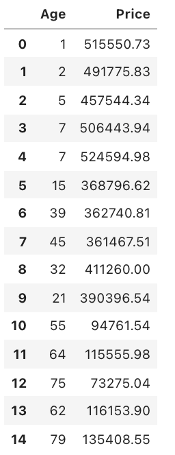
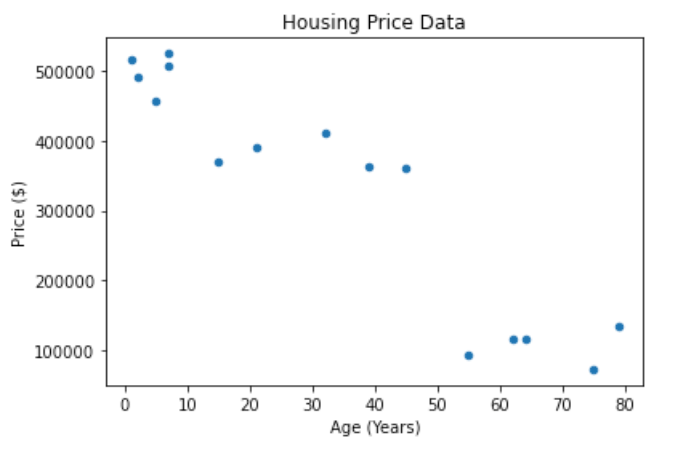
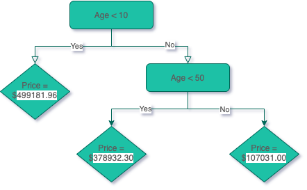
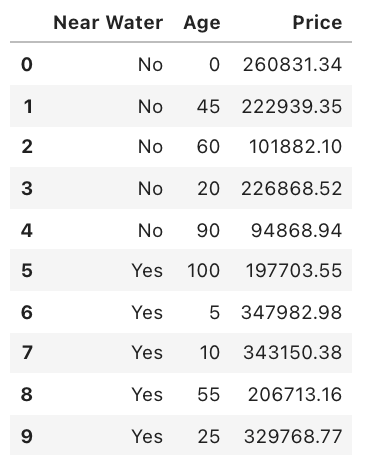
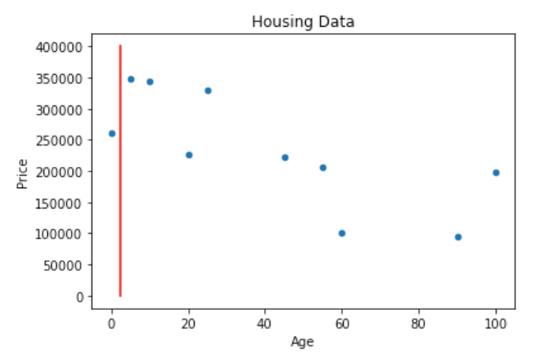
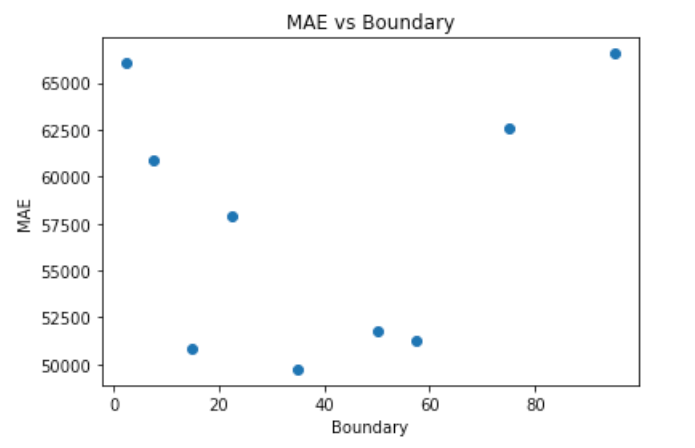
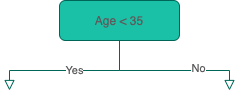
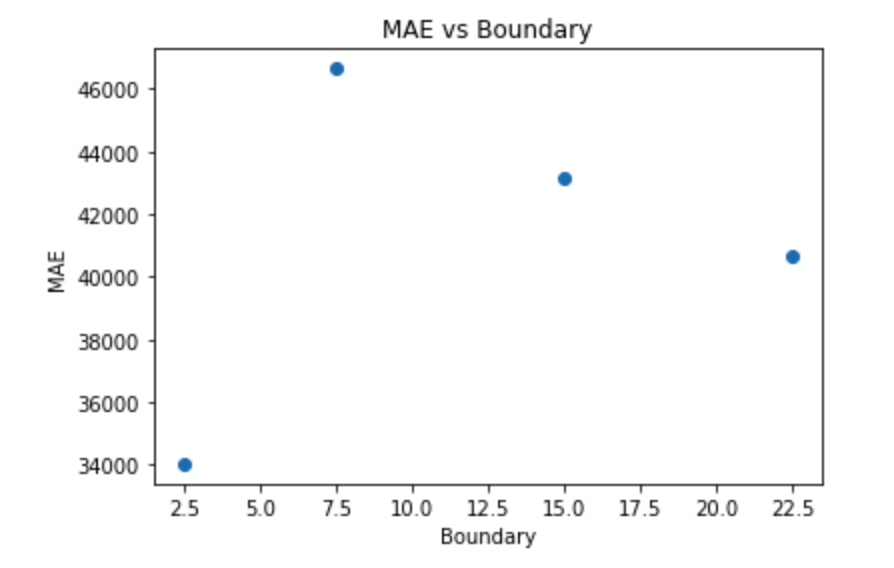

## chapter 3: Regression Trees

### Lec 1: Introduction to Regression Trees
Regression Trees
As we have already seen, decision trees can be used for classification, but we can also use them for regression, commonly called regression trees. 

The basic idea behind regression trees is to split our data into groups based on features, like in classification, and return a prediction that is the average across the data we have already seen. 

Consider the housing data below, where we are using the ‘Age’ to predict the ‘Price’ of a house. 

Here, we can see the difference age has on the house prices. Ages between 0 and 10 have an average price of approximately $500,000, ages between 10 and 50 have an average price of approximately $380,000 and houses older than 50 years have an average price of approximately $100,000. Using these general ranges, we can predict the price of a house. 

Using the data above, we can create the regression tree, as shown below. The prices were determined by calculating the average price of the houses in the age range. 

As you can see, we use the features to group the houses and then calculate the average price across these groupings. 

  

Criterion 
The way the trees are built are similar to classification, but instead of using the entropy criterion. In Classification Trees, we choose features that increase the information gain. In Regression Trees, we choose features that minimize the error. 

A popular one is the Mean Absolute Error, which we have also seen previously.

MAE= n1i=1∑n∣y i− y^i∣

How Regression Trees are Built? 
Take the dataset sample shown below, the first step is to decide what the first decision is. We will do this by using the criterion and checking every single feature in the dataset to see which one produces the minimal error. 

Categorical Features 
Categorical features are simple, here we have Near Water so all we need to do is calculate the error if we used this as the first feature. Near Water feature has two categories: ‘Yes’ and ‘No’, therefore, we must calculate the average ‘Price’ of houses in the ‘Yes’ and ‘No’ categories. Then we use those values to calculate the average error. 

‘No’ Category:
Index of Houses in ‘No’ Category = [0, 1, 2, 3, 4]
Prices of Houses in ‘No’ Category = [260831.34, 222939.35, 101882.1, 226868.52, 94868.94] 
Average House Price in ‘No’ Category = 181478.05
Absolute Error = [79353.29, 41461.30, 79595.95, 45390.47, 86609.11] 

‘Yes’ Category:
Index of Houses in ‘Yes’ Category = [5,6,7,8,9]
Prices of Houses in ‘Yes’ Category = [197703.55, 347982.98, 343150.38, 206713.16, 329768.77] 
Average House Price in ‘Yes’ Category = 285063.77
Absolute Error = [87360.22, 62919.22, 58086.61, 78350.61, 44705.00] 

MAE 
This is the MAE of the Near Water feature, and this number will be used to compare against MAE of all other features to determine which one is the lowest. Therefore, it will establish the first decision in our regression tree. 

MAE = 66383.17   

Numerical Features 
Numerical features, like ‘Age’, are trickier to handle because we need to find a number, instead of using a category, to split the data by. We do this by creating a boundary between each point, then we calculate the error. 

For example, first we create the boundary between the first two data points, which are (0, 260831.34) and (5, 347982.98), so we create a boundary of x = 2.5 (The midpoint between the x component of the first two data points). We now find the average price of the houses on the left and right sides of this boundary and use it to calculate the MAE. 

Left: 
Index of Houses on the Left Side = [0]
Prices of Houses on the Left Side = [260831.34] Average House Price of Left Side = 260831.34 Absolute Error = [0]

Right: 
Index of Houses on the Right Side = [1, 2, 3, 4, 5, 6, 7, 8, 9] 
Prices of Houses in the Right Category = [222939.35, 101882.1, 226868.52, 94868.94, 197703.55, 347982.98, 343150.38, 206713.16, 329768.77] 
Average House Price in the Right Category = 230208.64 
Absolute Error = [7269.29, 128326.54, 3340.12, 135339.7, 32505.09, 117774.34, 112941.74, 23495.48, 99560.13] 

MAE 
Now we can find the MAE, using the absolute errors from the left and right sides. 

MAE = 66055.24 

Further Steps 
This process is then repeated for each boundary between each pair of consecutive points. 

This results in the following MAE for each boundary: 

Where the values for the points are:

(2.5, 66055.24)
(7.5, 60871.09)
(15, 50847.52)
(22.5, 57918.2)
(35, 49726.55)
(50, 51792.86)
(57.5, 51288.06)
(75, 62616.49)
(95, 66568.42)

We can see that the boundary 35 results in the lowest MAE in this feature. 

Choosing the Decision 
Now, we compare the categorical MAE and the lowest numerical MAE, in this case, the categorical is 66055.24, and the numerical is 49726.55. So, for the first decision, we will use the numerical ‘Age’ feature. We end up with a regression tree that looks like this: 

When do we Stop? 
With the regression tree above, we have two options, we can either stop here and use the average value of the ‘Yes’ (left) and ‘No’ (right) to predict the house prices, or we can continue to add more decisions to either branch. There are a few conditions that are commonly used to stop growing regression trees: 

• Tree depth
• Number of remaining samples on a branch
• Number of samples on each branch if another decision is made 

The depth of the tree above, is 1, because there is a single decision and the number of samples on each side is 5. Let’s add more decisions until the depth of the tree is 2. First, we start with the ‘Yes’ (left) side and we calculate the MAE for the features using the houses that have ‘Age’ < 35.

Adding Decisions
Left
Like before, we use the Near Water feature and calculate the MAE on houses with index 0, 3, 6, 7, and 9.

Categorical Features
MAE = 11005.34

Numerical Features
Now, we find the MAE for the boundaries in the ‘Age’ feature.

We can see that the Near Water feature causes the MAE to be lowest on the ‘Yes’ (left) side of the regression tree, so we will add a decision for the Near Water feature.

Right
Now we will find the features that result in the lowest MAE from the houses with index 1, 8, 2, 4, and 5.

Categorical Features
MAE = 35018.94

Numerical Features

Here, we can also see that the ‘Age’ feature will result in the lowest MAE with the boundary set to 57.5, so on the ‘No’ (right) side of the tree, we will add another decision for the ‘Age’ feature.

Final Result

### lec 2 : Lab: Regression 

Lab: Regression Trees
In this notebook, you will learn how to build and train Regression Trees using Scikit-Learn. You will then use Regression Trees to predict house prices. To launch the lab notebook in a new browser tab, check the box below and click on the "Launch App" button.  Optionally, you can click 
HERE
 to download the lab notebook (.ipynb) or open the lab by clicking the 
link.

Please notice that the practice labs (except the last week assignment) are optional and are provided for you to practice and understand the topic. Therefore, you do not need to submit those, as they are not graded, and won't be updated as complete. Just run the codes to see the results, and feel free to change it.

This course uses a third-party app, Lab: Regression Trees, to enhance your learning experience. The app will reference basic information like your name, email, and Coursera ID.
Coursera Honor Code
I agree to use this app responsibly.

### Lec 3: Lab: Faster Taxi Tip Prediction Using Snap ML
